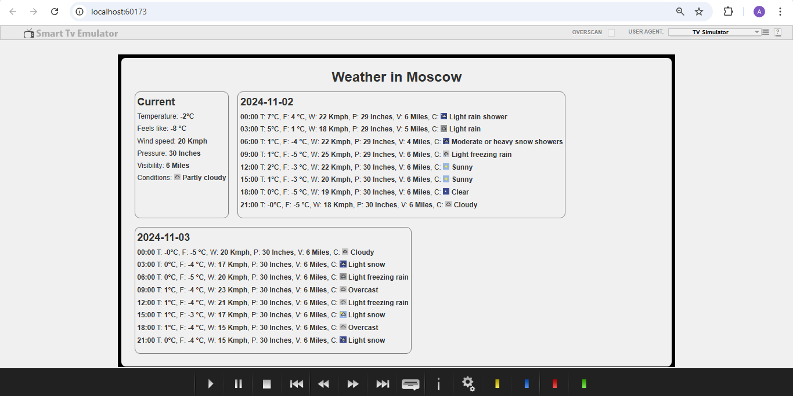

# Weather widget for smart TV (svelte app)
Added project and unit tests.

The final view is as follows:

# Installation and start-up
1. npm install
2. npm run dev
3. npm run test

Used this chrome Smart TV emulator for testing: https://smart-tv-emulator.softonic.ru/chrome/extension.

